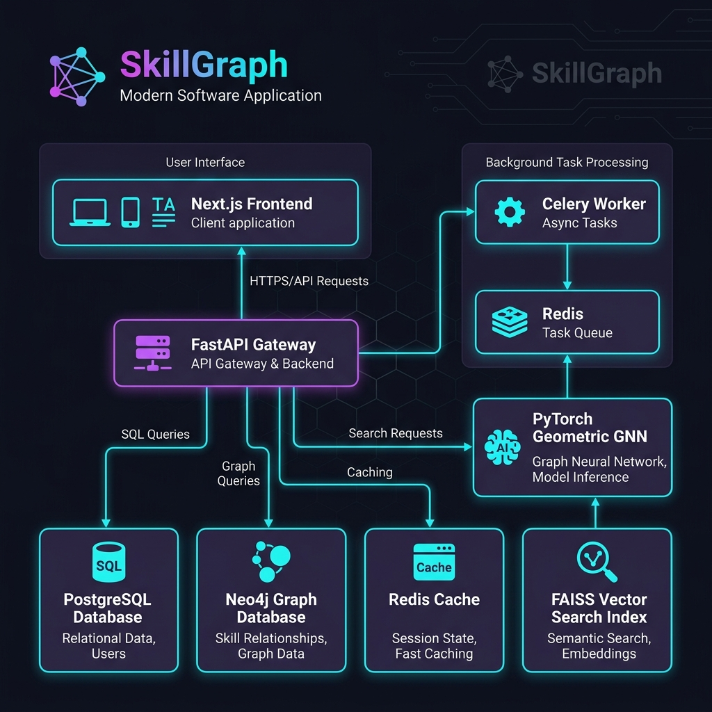
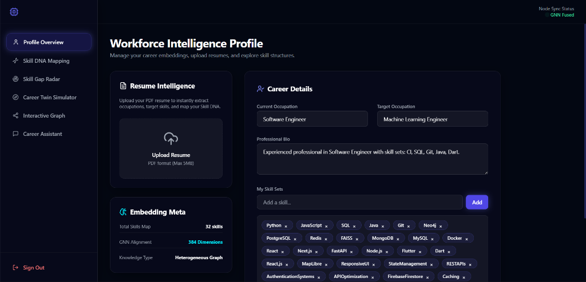
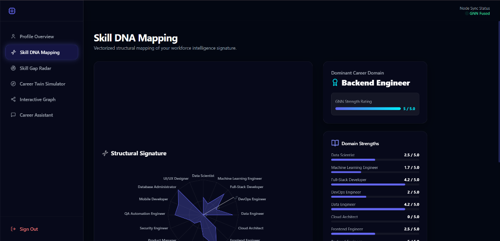
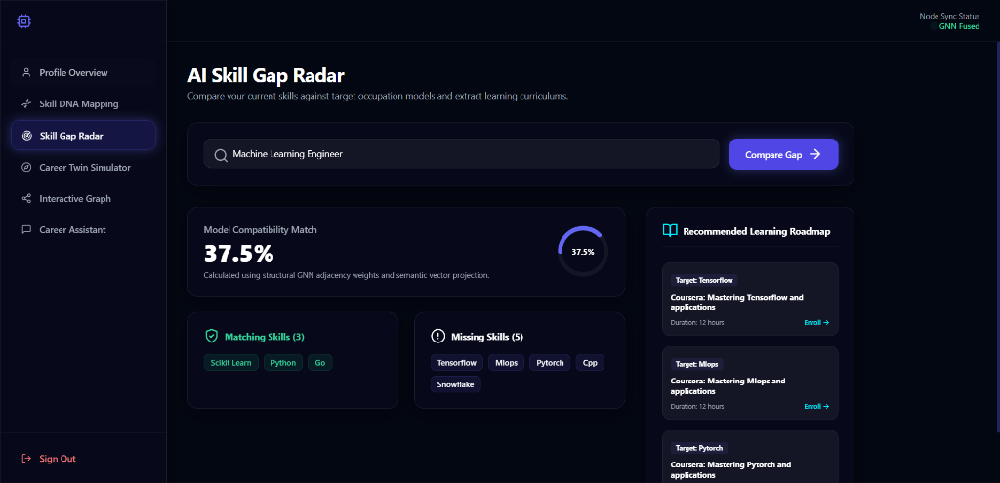
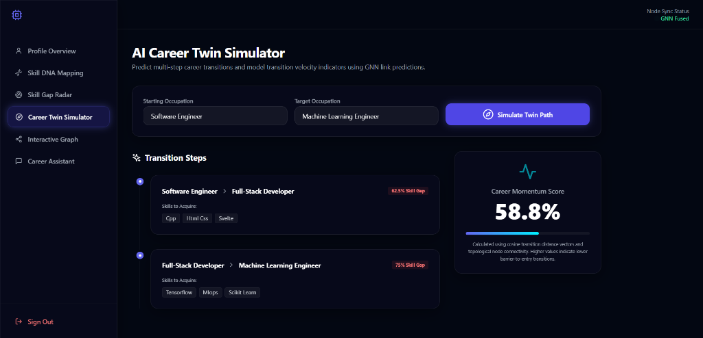
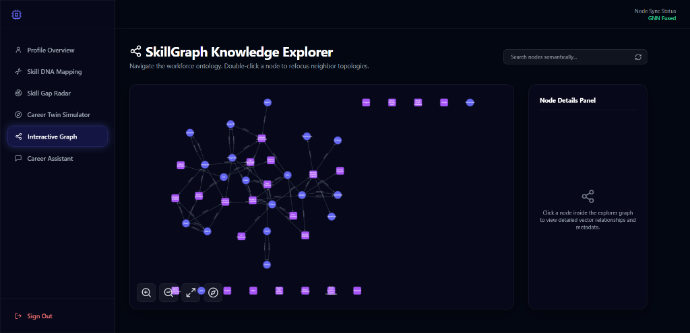

# 🧬 SkillGraph: AI-Powered Workforce Ontology & Career Recommender

SkillGraph is an enterprise-grade platform designed to map workforce skills, build dynamic career paths, and predict skill transitions using Graph Neural Networks (GNNs). By combining PostgreSQL (relational user schemas), Neo4j (graph-structured skill ontologies), and advanced deep learning, SkillGraph provides semantic search, career paths, and interactive graph exploration.

---

## 🏗️ System Architecture & Data Flow

SkillGraph is built as a modular, high-performance system leveraging a heterogeneous graph structure. The data flow moves seamlessly from resume ingestion to GNN-fused career recommendation:



### 🔄 The Ingestion & Recommendation Loop
1. **Resume Ingestion**: A user uploads a PDF resume. The backend extracts the layout, parses skills heuristically, and matches them dynamically against the Neo4j ontology.
2. **Skill DNA Generation**: The user's skills are mapped against the required skills of all standard occupations using Graph and DB lookups.
3. **GNN Embeddings**: A Heterogeneous Graph Transformer (HGT) / Relational Graph Attention Network (RGAT) matches users to careers by calculating the similarity of their fused structural-semantic embeddings.
4. **Career Twin Simulation**: If a user simulates a transition, the Neo4j database computes the shortest path between occupations, and the recommender predicts skill gaps and pulls appropriate learning resources.

---

## 🚀 Key Features & Interface

### 📊 1. Workforce Intelligence Profile
Manage your career embeddings, upload resumes, and explore skill structures. The glassmorphic interface displays your current metrics, parsed skills tags, and syncing status with the backend GNN engine.



### 🧬 2. Skill DNA Mapping
Visualize your technical competencies and structural overlaps. The dynamic radar/spider chart maps your personalized workforce intelligence signature across diverse domains.



### 🎯 3. AI Skill Gap Radar
Compare your current skillsets against target occupation models. Identify exact skill gaps and retrieve recommended learning roadmaps and course enrollments.



### ✈️ 4. AI Career Twin Simulator
Predict multi-step career transitions and calculate your career transition momentum score and velocity indicators using GNN link predictions.



### 🌐 5. Interactive Graph Explorer
Explore skills and job ontologies visually using a dynamic, interactive force-directed knowledge graph built with Cytoscape.js.



---

## 🛠️ Tech Stack

### Frontend (Next.js)
*   **Framework**: Next.js 13+ (App Router)
*   **Styling**: Tailwind CSS & Framer Motion (micro-animations)
*   **Visualizations**: Cytoscape.js (Interactive Ontology Graphs), Recharts (Radar charts & analytics)
*   **Language**: TypeScript

### Backend (FastAPI)
*   **API Framework**: FastAPI
*   **Databases**: PostgreSQL (Relational) & Neo4j (Graph Database)
*   **Cache & Queue**: Redis & Celery
*   **AI/ML Core**: PyTorch Geometric (GNN), Sentence-Transformers (Semantic Embeddings), FAISS (Fast Vector Search)
*   **Language**: Python 3.10+

---

## 📂 Project Structure

```text
├── backend/
│   ├── app/
│   │   ├── ai/          # GNN architecture, embedders, FAISS vector search
│   │   ├── api/         # REST API endpoints (auth, assistant, skills, etc.)
│   │   ├── core/        # App configuration, security settings
│   │   ├── db/          # DB connections, Neo4j schema & PostgreSQL migrations
│   │   ├── models/      # Database tables/ORM models
│   │   ├── schemas/     # Pydantic validation schemas
│   │   ├── services/    # Business logic & CV parsers
│   │   └── workers/     # Celery asynchronous task queues
│   ├── scripts/         # Seeding, importing, and dataset helper scripts
│   └── tests/           # Unit & integration testing suites
├── frontend/
│   ├── src/
│   │   ├── app/         # Next.js routes (Dashboard, Graph Explorer, DNA)
│   │   ├── components/  # Charting, graph rendering, and UI elements
│   │   └── lib/         # API clients
├── infrastructure/
│   ├── docker/          # Docker Compose configurations
│   └── kubernetes/      # Kubernetes deployment files
└── assets/              # Architecture diagrams and UI screenshots
```

---

## ⚙️ Quick Start

You can run SkillGraph using Docker (recommended) or set up the microservices locally.

### Method 1: Running with Docker Compose (Recommended)

To spin up all services—including database engines (Postgres, Neo4j, Redis), backend worker instances, and the web frontend—navigate to the infrastructure directory and start docker-compose:

```bash
cd infrastructure/docker
docker-compose up --build
```

Access the application components:
*   **Frontend**: `http://localhost:3000`
*   **Backend API**: `http://localhost:8000/docs` (Swagger UI)
*   **Neo4j Console**: `http://localhost:7474` (Credentials: `neo4j/password`)

---

### Method 2: Local Development Setup

#### 1. Start External Services (Database & Cache)
Ensure you have local instances of PostgreSQL, Redis, and Neo4j running. If you want to use Docker just for these dependencies, run:

```bash
cd infrastructure/docker
docker-compose up postgres redis neo4j -d
```

#### 2. Configure Environments
Create a `.env` file in the `backend/` directory:
```bash
cp backend/.env.example backend/.env
```
*(Update `.env` configuration details, database credentials, and model paths if necessary).*

#### 3. Backend Setup
1.  Navigate to the `backend/` directory:
    ```bash
    cd backend
    ```
2.  Create and activate a virtual environment:
    ```bash
    python -m venv venv
    # Windows:
    .\venv\Scripts\activate
    # macOS/Linux:
    source venv/bin/activate
    ```
3.  Install dependencies:
    ```bash
    pip install -r requirements.txt
    ```
4.  Seed the database & Neo4j graph:
    ```bash
    python scripts/seed_data.py
    ```
5.  Run the FastAPI development server:
    ```bash
    uvicorn app.main:app --reload
    ```
6.  *(Optional)* Start the Celery background worker:
    ```bash
    celery -A app.workers.tasks.celery_app worker --loglevel=info
    ```

#### 4. Frontend Setup
1.  Navigate to the `frontend/` directory:
    ```bash
    cd frontend
    ```
2.  Install packages:
    ```bash
    npm install
    ```
3.  Run the Next.js development server:
    ```bash
    npm run dev
    ```
4.  Open `http://localhost:3000` in your browser.

---

## 🧪 Running Tests

### Backend Unit Tests
Run backend tests with `pytest`:
```bash
cd backend
pytest
```
