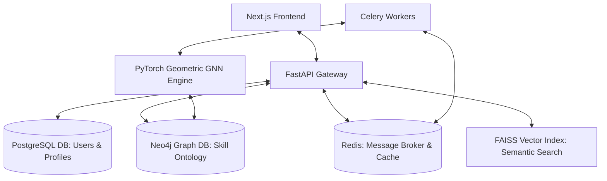

# 🧬 SkillGraph: Project Story & Technology Stack Guide

Welcome to the comprehensive technical documentation for **SkillGraph**, an enterprise-grade AI-powered Workforce Ontology & Career Recommender platform. This document tells the narrative story of the project, details the architectural decisions, and explains the purpose, role, and engineering rationale for every technology in the stack.

---

## 📖 The SkillGraph Narrative

### The Problem: The Workforce Skill Gap
In the modern technical landscape, skills are evolving at an unprecedented pace. Traditional resume screening, workforce planning, and career advisory systems rely on flat, keyword-based matching. They fail to capture:
1. **Semantic Overlaps**: Understanding that a developer listing "py" or "pyspark" is highly competent in "Python" and "Data Engineering".
2. **Structural Prerequisites**: Knowing that before learning "Graph Neural Networks", a professional needs "PyTorch" and "Deep Learning".
3. **Multi-Hop Career Transitions**: Mapping a transition path from a "Frontend Engineer" to a "DevOps Engineer" requires identifying intermediary roles (e.g., "Full-Stack Developer" or "Backend Engineer") and their associated skill gaps.

### The Solution: A Hybrid AI Ontology
SkillGraph solves this by modeling the workforce as a **heterogeneous knowledge graph**. It connects users, occupations, skills, certifications, learning resources, and companies using multi-relational edges. 

By running a specialized **Graph Neural Network (GNN)** on this topology and combining it with **Semantic Transformers**, the platform generates **fused embeddings** (semantic + structural). These embeddings represent a user's "Skill DNA", predicting compatible career transitions, measuring precise skill gaps, and recommending targeted learning resources.

---

## 🏗️ System Architecture & Data Flow

SkillGraph is designed as a modular, containerized microservices platform:

### The Ingestion & Recommendation Loop
1. **Resume Ingestion**: A user uploads a PDF resume. The backend extracts the layout, parses skills heuristically from sections, and matches them dynamically against the Neo4j ontology.
2. **Skill DNA Generation**: The user's skills are mapped against the required skills of all standard occupations using Graph and DB lookups.
3. **GNN Embeddings**: The PyTorch Geometric GNN matches users to careers by calculating the similarity of their fused structural-semantic embeddings.
4. **Career Twin Simulation**: If a user simulates a transition, the Neo4j database computes the shortest path between occupations, and the recommender predicts skill gaps and pulls appropriate learning resources.

---

## 🛠️ Technology Stack Breakdown

Below is a detailed guide to every core technology utilized in SkillGraph, explaining what it is, its role in the system, and why it is indispensable.

---

### 1. Next.js (App Router, TypeScript)
*   **What it is**: A React framework developed by Vercel for building high-performance web applications with server-side rendering (SSR) and routing.
*   **Role in SkillGraph**: Serves as the web client, rendering the user dashboard, the Skill DNA visualizer, the interactive career path simulation, and the chat interface.
*   **Why we need it**:
    *   **App Router & Layouts**: Organizes dashboard pages, settings, and simulators cleanly.
    *   **TypeScript Safety**: Prevents runtime bugs by strictly typing API responses, profile shapes, and graph nodes.
    *   **Performance**: Fast initial page loads using hybrid static-server rendering.

### 2. Cytoscape.js
*   **What it is**: A high-performance, open-source JavaScript graph visualization library.
*   **Role in SkillGraph**: Powers the **Interactive Graph Explorer**, letting users visually interact with and navigate the skills ontology graph in the browser.
*   **Why we need it**:
    *   **Large Graph Render**: Cytoscape.js is built to render hundreds of nodes and connections smoothly using canvas rendering instead of heavy DOM structures.
    *   **Force-Directed Layouts**: Automatically spaces out skills and occupations logically, updating dynamically when a user clicks a node to expand its 1-hop neighbors.

### 3. FastAPI (Python)
*   **What it is**: A modern, high-performance web framework for building APIs with Python, based on standard Python type hints.
*   **Role in SkillGraph**: The core backend API Gateway. It exposes endpoints for Authentication, Profile Management, Recommendations, Graph Explorer, and handles WebSockets for the Career Coach Chatbot.
*   **Why we need it**:
    *   **High Performance**: Built on top of Starlette and Uvicorn, making it one of the fastest Python frameworks available, matching Go and Node.js speeds.
    *   **Asynchronous Support**: Full `async/await` integration, allowing concurrent connections to PostgreSQL, Neo4j, and Redis without blocking requests.
    *   **Automatic OpenAPI**: Automatically generates interactive Swagger UI documentation, making API integration seamless.

### 4. PostgreSQL (SQLAlchemy Async)
*   **What it is**: An advanced, open-source object-relational database.
*   **Role in SkillGraph**: Stores transactional, user-centric state, including:
    *   User credentials and hashed passwords.
    *   User profile metadata (bio, experience records, raw resumes).
    *   Saves and logs of Career Twin simulations.
*   **Why we need it**:
    *   **ACID Compliance**: Ensures total data consistency and security for user credentials and settings.
    *   **Relational Integrity**: Uses foreign key constraints to link users, profiles, and recommendations stably.
    *   **JSONB Support**: Allows storing semi-structured data (like parsed experience lists) inside relational rows with fast lookup speeds.

### 5. Neo4j (Graph Database)
*   **What it is**: A native, persistent property graph database.
*   **Role in SkillGraph**: Stores the core **Skill Ontology Knowledge Graph**, representing nodes (Skills, Occupations, Companies, Certifications, Learning Resources, Technologies) and their highly connected relations (e.g. `REQUIRES`, `SIMILAR_TO`, `PREREQUISITE_FOR`, `USED_IN`).
*   **Why we need it**:
    *   **Native Graph Traversals**: Relational databases struggle with multi-hop recursive queries (e.g., finding prerequisite skill chains or connecting job hops), requiring slow, complex table JOIN operations. Neo4j traverses millions of connections per second using the Cypher query language.
    *   **Schema Flexibility**: Allows adding new node classes or relationship types dynamically without rewriting database tables.

### 6. Redis & Celery
*   **What it is**: **Redis** is an in-memory data structure store used as a message broker. **Celery** is an asynchronous task queue.
*   **Role in SkillGraph**: Handles long-running background tasks, specifically:
    *   Asynchronous GNN model training cycles.
    *   FAISS semantic index rebuilds when new skills are added.
    *   Background ingestion and layout parsing of large PDF resumes.
*   **Why we need it**:
    *   **Non-Blocking APIs**: If a user clicks "Retrain Model" or uploads a heavy resume, running this synchronously would block the web server and lead to timeouts. Celery delegates this to background worker threads, returning an immediate "task accepted" state to the client.

### 7. PyTorch Geometric (PyG)
*   **What it is**: A library built on PyTorch to write and train Graph Neural Networks (GNNs) for structured graph datasets.
*   **Role in SkillGraph**: Implements a Heterogeneous Graph Transformer (HGT) / Relational Graph Attention Network (RGAT) that runs message passing across the Neo4j graph nodes.
*   **Why we need it**:
    *   **Structural Representation Learning**: Standard machine learning models cannot interpret graph structures. PyG analyzes neighborhood topologies, learning that if "Docker" is connected to "Kubernetes" and both are required for "DevOps", their embeddings should cluster together structurally.
    *   **Fused Embeddings**: Melds textual semantics with physical graph locations to output structural-semantic embeddings.

### 8. Sentence-Transformers (all-MiniLM-L6-v2)
*   **What it is**: A Python framework for state-of-the-art sentence, text, and image embeddings.
*   **Role in SkillGraph**: Encodes raw skill names, resume text, and job descriptions into dense 384-dimensional floating-point vectors.
*   **Why we need it**:
    *   **Semantic Matching**: Enables matching "JS" to "JavaScript" or "pyspark" to "Apache Spark" by mapping them into a shared vector space, even if they have zero structural connections in the graph yet.
    *   **Lightweight**: The `all-MiniLM-L6-v2` model is highly optimized, generating high-quality embeddings on CPU rapidly without requiring expensive GPU infrastructure.

### 9. FAISS (Facebook AI Similarity Search)
*   **What it is**: A library for efficient similarity search and clustering of dense vectors.
*   **Role in SkillGraph**: Indexes the semantic embeddings of all skills and occupations to perform sub-millisecond nearest-neighbor lookups.
*   **Why we need it**:
    *   **Instant Query Fallback**: When the GNN model weights are not loaded or Neo4j is offline, FAISS serves as a high-speed vector search DB, matching user queries semantically.
    *   **Scale**: Capable of querying millions of vectors in microseconds, bypassing Python-loop calculation bottlenecks.

### 10. Docker (Compose)
*   **What it is**: A containerization platform that packages applications and their dependencies into portable, isolated containers.
*   **Role in SkillGraph**: Bundles PostgreSQL, Neo4j, Redis, Celery Workers, the FastAPI Backend, and the Next.js Frontend into distinct containers, managing their network links and persistent volumes.
*   **Why we need it**:
    *   **Environment Parity**: Eliminates local setup bugs ("works on my machine") by providing identical software packages, libraries, and database versions across all developer and production instances.
    *   **One-Command Setup**: Allows launching the entire system with database healthchecks using a single `docker-compose up` command.
